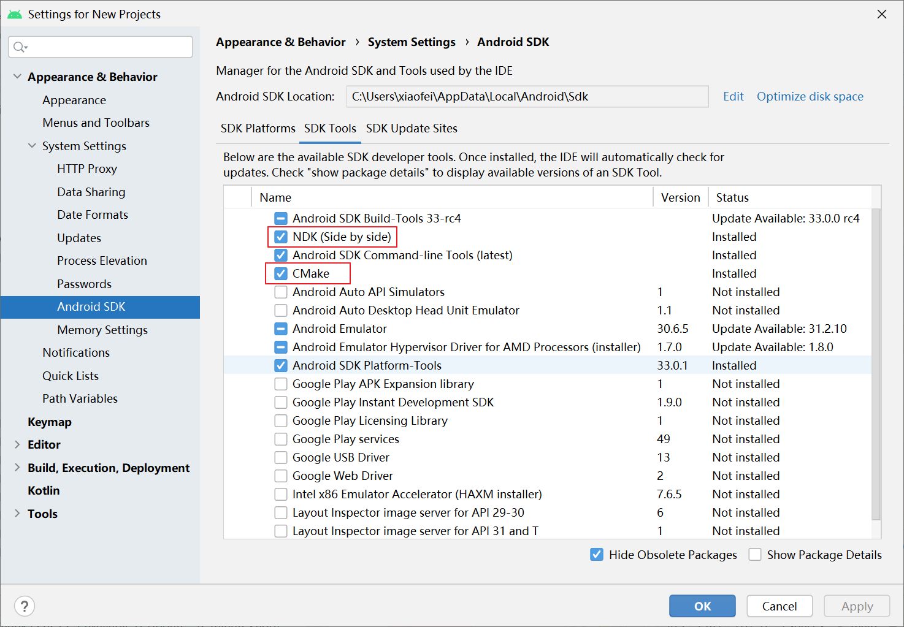
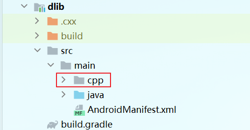
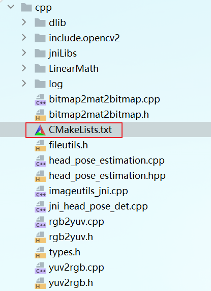
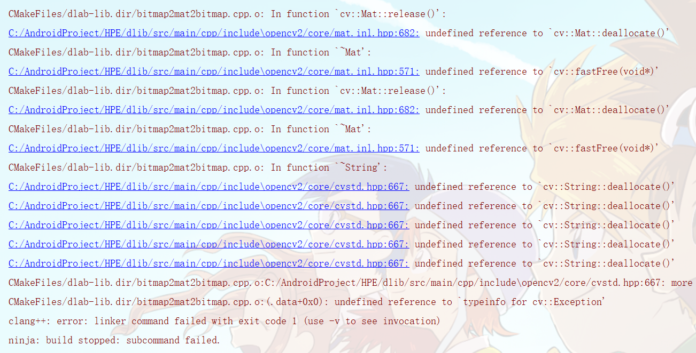

## Android NDK 概览

Android NDK（Native Development Kit 原生开发套件 ） 是一个工具集，可让我们使用 C 和 C++ 等语言以原生代码实现应用的各个部分。对于特定类型的应用，这可以帮助我们重复使用以这些语言编写的代码库，以进一步提升设备性能，以降低延迟或运行游戏或物理模拟等计算密集型应用。像是本项目中用到的 dlib 库，可以帮助我们很好地进行人脸识别，特征点检测之类的工作。

NDK 可以将 C 和 C++ 代码编译到原生库中，然后使用 Android Studio 的集成构建系统 Gradle 将原生库打包到 APK 中。Java 代码随后可以通过 Java 原生接口 (JNI) 框架调用原生库中的函数。

AS 编译原生库的默认构建工具是 CMake。但由于很多老项目都使用 ndk-build （AS 中旧的原生库构建工具）构建工具包，因此 AS 也支持 ndk-build。不过创建新的原生库我们应使用 CMake。

要在新版本的 AS 中使用 NDK 我们需要先下载好相关的 SDK。在 AS 的 SDK Tools 中勾上【NDK】和【CMake】这两个开发组件，然后根据提示等待下载和解压完毕：



注意 NDK 的最新版本可能会有些 bug，我们可以选择安装版本稍旧的 NDK，使用起来会更稳定可靠。

相关组件装好后，我们就可以在 AS 中开发 C/CPP 代码了。

## 项目原生库模块搭建

对于我们项目中用到 C/CPP 代码的库模块，其总体目录结构如下：



其中所有的 C/CPP 源码和 CMake 构建脚本都放在 cpp 目录下。

包含 C/CPP 代码的库模块自然跟普通的库模块是有差别的，所以模块对应的 gradle 脚本自然也要特别配置一下。其跟原生代码相关的特殊脚本内容如下：

```groovy
...

android {
    ...

    //指定 ndk 版本
    ndkVersion '21.4.7075529'

    defaultConfig {
        ...

        externalNativeBuild {
            cmake {
                //指定一些编译参数，均为可选
                cppFlags "-std=c++11","-frtti", "-fexceptions"
                arguments '-DANDROID_STL=c++_static'
                arguments 'APP_STL=c++_static'
            }
        }

        ndk {
            //手动指定生成的原生动态库的 abi 版本
            abiFilters 'armeabi-v7a', 'arm64-v8a'
        }
    }

    externalNativeBuild {
        cmake {
            //指定 cmake 脚本文件位置
            path "src/main/cpp/CMakeLists.txt"
            //指定 cmake 版本
            version "3.10.2"
        }
    }

    ...
}

...
```
好啦，模块 gradle 脚本中关于 C/CPP 代码相关配置主要就是以上这些。

## 原生代码

本项目是基于老项目的 ndk-build 构建方式修改而来，因此主要的 C/CPP 代码基本还是沿用的老项目中的 C/CPP 代码，不过脚本配置和文件目录结构等都有较大调整。

接下来就是将所有相关的 C/CPP 代码放在我们模块的 cpp 目录下。然后就是非常关键的 cmake 脚本文件，直接放在 cpp 目录下：



其中关键部分是声明动态原生库的部分：

```cmake
add_library(
        # Sets the name of the library.
        dlab-lib
        # Sets the library as a shared library.
        SHARED

        # Provides a relative path to your source file(s).
        ...
        #main
        imageutils_jni.cpp
        jni_head_pose_det.cpp
)
```
## OpenCV

在移动开发中，如果我们要实现一些图像处理相关的功能，难免要用到OpenCV。而OpenCV是用c++开发的。我们在Android中，需要使用jni的方法去使用它。

本项目的核心功能实现需要 OpenCV 的支持，接下来要做的就是把 OpenCV 库集成到项目中。OpenCV 官方也专门提供了 Android 的 SDK，以方便我们将其集成到项目中。

[OpenCV SDK 下载](https://github.com/opencv/opencv/releases)

本项目使用的 3.1.0 版本的 OpenCV Android SDK。下载完官方提供的 OpenCV Android SDK 后解压到一个文件夹里，就可以按步骤集成到项目中了：

首先，我们找到或新建jniLibs文件夹，然后将依赖的动态库和静态库（路径为`OpenCV-android-sdk\sdk\native\libs`）拷贝到`\src\main\jniLibs`下面。

然后，找到cpp文件夹。将include文件夹（路径`OpenCV-android-sdk\sdk\native\jni\include`）拷贝到cpp（路径`\app\src\main\cpp`）文件夹里。

最后，我们需要在CMakeLists.txt中，加入opencv相关的声明。由于配置比较复杂，在此直接将项目里的 CMakeLists.txt 中的内容贴到这里：

```cmake
#开始 OpenCV
set(CMAKE_VERBOSE_MAKEFILE on)
set(libs "${CMAKE_SOURCE_DIR}/jniLibs")
include_directories(${CMAKE_SOURCE_DIR}/include)

#include_directories(${CMAKE_SOURCE_DIR}/src/main/cpp/include/opencv2)

add_library(libopencv_calib3d STATIC IMPORTED )
set_target_properties(libopencv_calib3d PROPERTIES
        IMPORTED_LOCATION "${libs}/${ANDROID_ABI}/libopencv_calib3d.a")

add_library(libopencv_core STATIC IMPORTED )
set_target_properties(libopencv_core PROPERTIES
        IMPORTED_LOCATION "${libs}/${ANDROID_ABI}/libopencv_core.a")

add_library(libopencv_java3 SHARED IMPORTED )
set_target_properties(libopencv_java3 PROPERTIES
        IMPORTED_LOCATION "${libs}/${ANDROID_ABI}/libopencv_java3.so")

add_library(libopencv_features2d STATIC IMPORTED )
set_target_properties(libopencv_features2d PROPERTIES
        IMPORTED_LOCATION "${libs}/${ANDROID_ABI}/libopencv_features2d.a")

add_library(libopencv_flann STATIC IMPORTED )
set_target_properties(libopencv_flann PROPERTIES
        IMPORTED_LOCATION "${libs}/${ANDROID_ABI}/libopencv_flann.a")

add_library(libopencv_highgui STATIC IMPORTED )
set_target_properties(libopencv_highgui PROPERTIES
        IMPORTED_LOCATION "${libs}/${ANDROID_ABI}/libopencv_highgui.a")

add_library(libopencv_imgcodecs STATIC IMPORTED )
set_target_properties(libopencv_imgcodecs PROPERTIES
        IMPORTED_LOCATION "${libs}/${ANDROID_ABI}/libopencv_imgcodecs.a")

add_library(libopencv_imgproc STATIC IMPORTED )
set_target_properties(libopencv_imgproc PROPERTIES
        IMPORTED_LOCATION "${libs}/${ANDROID_ABI}/libopencv_imgproc.a")

add_library(libopencv_ml STATIC IMPORTED )
set_target_properties(libopencv_ml PROPERTIES
        IMPORTED_LOCATION "${libs}/${ANDROID_ABI}/libopencv_ml.a")

add_library(libopencv_objdetect STATIC IMPORTED )
set_target_properties(libopencv_objdetect PROPERTIES
        IMPORTED_LOCATION "${libs}/${ANDROID_ABI}/libopencv_objdetect.a")

add_library(libopencv_photo STATIC IMPORTED )
set_target_properties(libopencv_photo PROPERTIES
        IMPORTED_LOCATION "${libs}/${ANDROID_ABI}/libopencv_photo.a")

add_library(libopencv_shape STATIC IMPORTED )
set_target_properties(libopencv_shape PROPERTIES
        IMPORTED_LOCATION "${libs}/${ANDROID_ABI}/libopencv_shape.a")

add_library(libopencv_stitching STATIC IMPORTED )
set_target_properties(libopencv_stitching PROPERTIES
        IMPORTED_LOCATION "${libs}/${ANDROID_ABI}/libopencv_stitching.a")

add_library(libopencv_superres STATIC IMPORTED )
set_target_properties(libopencv_superres PROPERTIES
        IMPORTED_LOCATION "${libs}/${ANDROID_ABI}/libopencv_superres.a")

add_library(libopencv_video STATIC IMPORTED )
set_target_properties(libopencv_video PROPERTIES
        IMPORTED_LOCATION "${libs}/${ANDROID_ABI}/libopencv_video.a")

add_library(libopencv_videoio STATIC IMPORTED )
set_target_properties(libopencv_videoio PROPERTIES
        IMPORTED_LOCATION "${libs}/${ANDROID_ABI}/libopencv_videoio.a")

add_library(libopencv_videostab STATIC IMPORTED )
set_target_properties(libopencv_videostab PROPERTIES
        IMPORTED_LOCATION "${libs}/${ANDROID_ABI}/libopencv_videostab.a")

add_library(libopencv_ts STATIC IMPORTED )
set_target_properties(libopencv_ts PROPERTIES
        IMPORTED_LOCATION "${libs}/${ANDROID_ABI}/libopencv_ts.a")

set(CMAKE_CXX_FLAGS "${CMAKE_CXX_FLAGS} -std=gnu++11 -fexceptions -frtti")
#-------------------------------------------------OpenCV 结束
...
...
target_link_libraries(dlab-lib
		#指定要依赖的 OpenCV 静态和动态代码库
        libopencv_java3
        libopencv_calib3d
        libopencv_core
        libopencv_features2d
        libopencv_flann
        libopencv_highgui
        libopencv_imgcodecs
        libopencv_imgproc
        libopencv_ml
        libopencv_objdetect
        libopencv_photo
        libopencv_shape
        libopencv_stitching
        libopencv_superres
        libopencv_video
        libopencv_videoio
        libopencv_videostab
        ...
)
```

注意相关静态和动态库文件的链接，如果不声明好，可能会报【找不到定义】的错误，从而导致 build 失败：



这样配置好之后，我们就可以在 cpp 中，直接使用 OpenCV 库了。

## dlib

接下来就是把本项目所依赖的最重要的第三方 C++ 库—— dlib，引入项目中。

Dlib是建立在OpenCV基础上的一个计算机视觉库，很多方面在一定程度上优于OpenCV的效果，比如人脸检测，人脸关键点提取，其检测准确率比OpenCV更高，鲁棒性也更好，但是随之牺牲的是计算时间以及硬件资源。

[dlib 源码](https://github.com/davisking/dlib/tree/a57b5652fdf1ae88fe2b6b14c4e0ccd47d58140c)

dlib 库的源码树也是相当庞大，但集成到我们项目中的时候比 OpenCV 简单多了。

在 CMakeLists.txt 中：

```cmake
add_library(
        # Sets the name of the library.
        dlab-lib
        # Sets the library as a shared library.
        SHARED

        # Provides a relative path to your source file(s).
        ...
        #dlib
        dlib/threads/threads_kernel_shared.cpp
        dlib/threads/threads_kernel_shared.h
        dlib/entropy_decoder/entropy_decoder_kernel_2.cpp
        dlib/entropy_decoder/entropy_decoder_kernel_2.h
        dlib/base64/base64_kernel_1.cpp
        dlib/base64/base64_kernel_1.h
        dlib/threads/threads_kernel_1.cpp
        dlib/threads/threads_kernel_1.h
        dlib/threads/threads_kernel_2.cpp
        dlib/threads/threads_kernel_2.h
        ...
)
```

最后还有件非常重要的事，那就是在 CMakeLists.txt 中设置编译优化选项：

```cmake
#编译优化选项，重要！！！一定要设置好
set(CMAKE_CXX_FLAGS_DEBUG  "${CMAKE_CXX_FLAGS_DEBUG} -Ofast")
set(CMAKE_CXX_FLAGS_RELEASE  "${CMAKE_CXX_FLAGS_RELEASE} -Ofast")

set(CMAKE_C_FLAGS_DEBUG  "${CMAKE_C_FLAGS_DEBUG} -Ofast")
set(CMAKE_C_FLAGS_RELEASE  "${CMAKE_C_FLAGS_RELEASE} -Ofast")
```
如果不设置编译优化选项，会导致我们的 cpp 代码在运行时相当卡顿！

## 总结

比起老项目之前在外部通过命令行编译出动态 so 库的方式，本新项目主要的更改是直接将所有的 c/cpp 代码放到主工程里，这样方便直接对核心人脸检测功能的代码进行修改，这包括了与人脸检测功能相关的所有 c/cpp 和 Java 代码，比之前主工程的原生代码依赖方式要科学许多。
